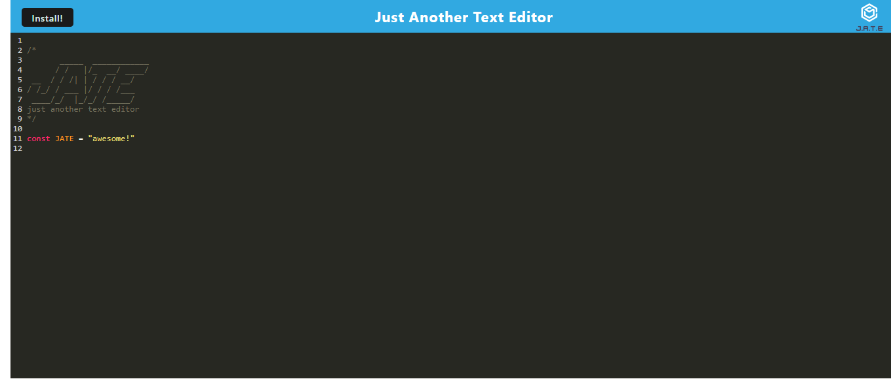

# Hwk19-JATE
Just Another Text Editor is a note and code snippet application that is downloadable from the browser. It functions with or without internect connection. This applicaiton is deployed via Heroku.

## Table of Contents
* [Installation](#installation)
* [Useage](#useage)
* [Liscence](#liscence)
* [Credits](#credits)

## Installation
To Install JATE launch the application via the [Heroku link](https://allister-and-jate-b435dfa031e9.herokuapp.com/). Once deployed, JATE will open in the browser. In the upper left hand corner of the application there is an installation button. Clicking this will install the JATE application.

## Useage
JATE is a note taker that is representative of code writing applications. In JATE users can type out code snippets and have their code formatted in JavaScript formatting. For example `var`,`let`, and `const` will change color to signify that a variable is being declared. Users are also able to use `//` and `*/` to comment out their notes from code. JATE can be used in the browser or via desktop and will retain any text that has been typed in both methods of use. 

## Liscence

## Credits
Starter Code for JATE was provided by UC Berkley's Full Stack Coding Bootcamp Course. This version was refacted by Allister Seras Kalag.
Just Another Text Editor can be accessed here: [https://allister-and-jate-b435dfa031e9.herokuapp.com/](https://allister-and-jate-b435dfa031e9.herokuapp.com/)
[GitHub: allister.seras](https://github.com/allister-seras/Hwk19-JATE/commits?author=allister-seras)
